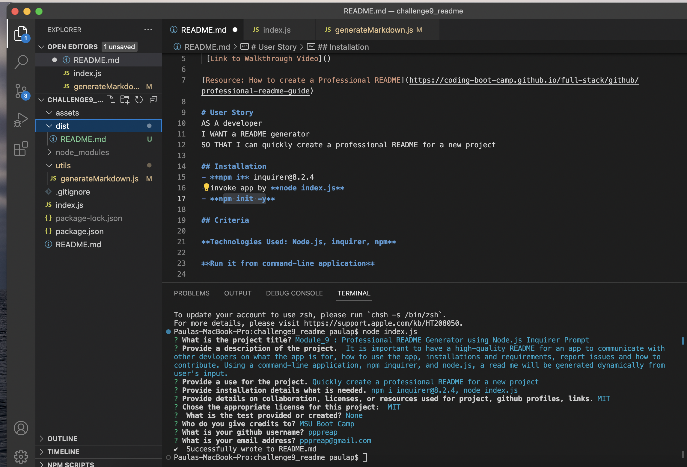

# Module_9 : Professional README Generator using Node.js Inquirer Prompt
 It is important to have a high-quality README for an app to communicate with other devlopers on what the app os for, hwo to use the app, installations and requirements, report issues and how to contribute.
 Using a command-line application, npm inquirer, and node.js, a read me will be generated dynamically from user's input.

 [Link to Walkthrough Video]()

[Resource: How to create a Professional README](https://coding-boot-camp.github.io/full-stack/github/professional-readme-guide)

# User Story 
AS A developer
I WANT a README generator
SO THAT I can quickly create a professional README for a new project

## Installation
- **npm i** inquirer@8.2.4
- invoke app by **node index.js**
- **npm init -y**

## Criteria

**Technologies Used: Node.js, inquirer, npm**

**Run it from command-line application**

GIVEN a command-line application that accepts user input:

WHEN the **user is prompted for information about my application repository,**
THEN a **high-quality, professional README.md is generated with the title of my project and sections entitled Description, Table of Contents, Installation, Usage, License, Contributing, Tests, and Questions**

WHEN  the **user enter my project title,**
THEN this is **displayed as the title of the README.**

WHEN the user **enter a description, installation instructions, usage information, contribution guidelines, and test instructions,**
THEN this information is added to the **sections of the README entitled Description, Installation, Usage, Contributing, and Tests.**

WHEN the user **choose a license for my application from a list of options,**
THEN a **badge for that license is added near the top of the README** and a notice is added to the section of the README entitled License that explains which license the application is covered under.

WHEN the user **enter my GitHub username,**
THEN this is added to the **section of the README entitled Questions, with a link to my GitHub profile.**

WHEN the user **enter my email address,**
THEN this is added to the section of the README entitled Questions, with instructions on how to reach me with additional questions.

WHEN the user **click on the links in the Table of Contents,**
THEN I am taken to the **corresponding section** of the README.

### Assets
These are images and video of the working generator: run from command prompts, enter responses, read me generated

#### Links
[Github Repository]:(https://github.com/pppreap/challenge9_readme)
///
[Link to Video Walkthrough]

#### Credits/Licenses
Starter Code: Michigan State University Full Stack Development Coding Program. //
Insomnia for testing  //
Youtube for Video Hosting

